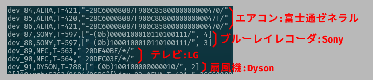
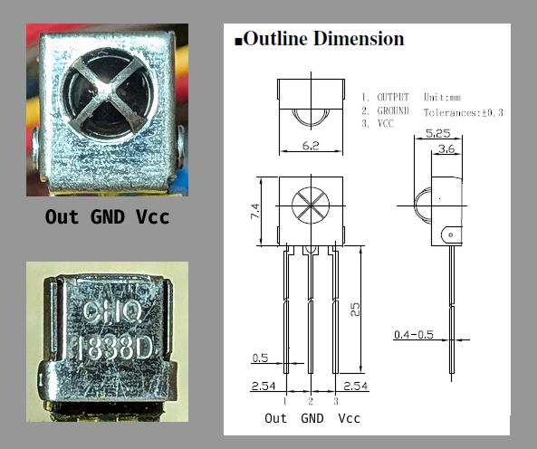

# pi0ir

IR remote control analysis Python library for Raspberry Pi.

Raspberry Pi に
安価な赤外線受信モジュールをつけるだけで、
リモコンのコードを解析することができます。


## == 特徴

- ``pigpio``を使った高速処理

- 多様な信号方式を自動判別して、信号を解析
  - AEHA (家電製品協会)
  - NEC
  - SONY
  - DYSON
  - BOSE




## == 実行環境

### === ハードウェア

- Raspberry Pi: Zero,3,4系 (「pico」と「5」 は、非対称)
- 赤外線リモコン受信モジュール -> [**== 参考**](#references)


### === ソフトウェア

- Raspberry Pi OS
- pigpio
- Python >= 3.11


## == インストール

### === install pigpio

通常は、すでにインストールされているはず。


### === install `mise`

言語横断的な開発環境の管理ツール、および、タスクランナー

``` bash
curl https://mise.run | sh
mise use -g usage@latest
```


### === install `uv` by `mise`

Python プロジェクトの管理ツール

``` bash
mise use -g uv@latest
```


### === install `pi0ir`

本ライブラリの本体

``` bash
git clone https://github.com/ytani01/pi0ir.git
cd pi0ir
mise run build
```


## == 使用方法

### === 赤外線アナライザー(CLI)

``` bash
uv run pi0ir analyze -p {ピン番号}
```


### === ライブラリとしての利用方法

[samples/](samples/) 以下のサンプルプログラム参照


## == 参考 <a id="references"></a>

### === 赤外線リモコン受信モジュール

#### ==== 例1 OSRB38C9AA

[秋月電子: 赤外線リモコン受信モジュールOSRB38C9AA](https://akizukidenshi.com/catalog/g/g104659/)

とても安価です。

単体で実験する際には、ノイズ対策しなくても動作しますが、
いろいろと組み合わせて使う場合には、ノイズ対策が必須です。




#### ==== 例2 モジュール基盤

ノイズ対策がされていて、目視確認用のLEDもついているので、使い勝手がとてもいいです。

[Amazon: IR赤外線センサー 送信機 + 受信機 キット](https://www.amazon.co.jp/dp/B09BCT5QXK)
