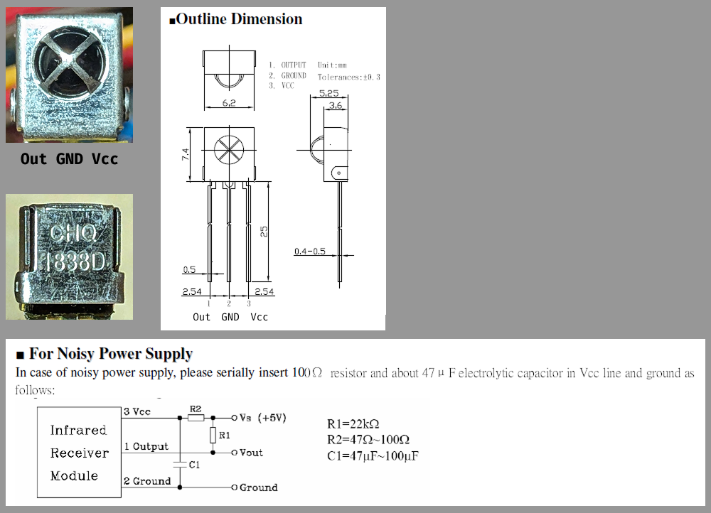

# pi0ir

Python library for IR signal receiver and controller.

## == 特徴

- ``pigpio``を使った高速処理
- 国内のリモコンで使用されいてる3つの方式を自動識別(家製協/NEC/SONY)

## == 実行環境

- Raspberry Pi: Zero,3,4系 (「pico」と「5」 は、非対称)
- Python >= 3.11

## == インストール

## == 使用方法

### === pigpiod

### === pi0ir

## == 参考

### === 赤外線リモコン受信モジュール

**例1** OSRB38C9AA

